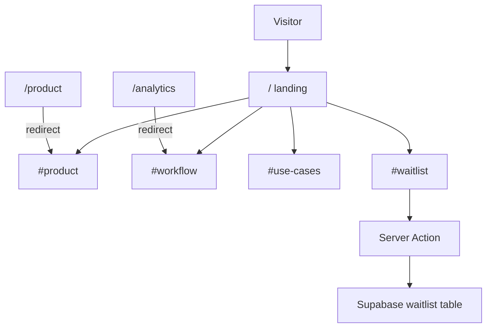

# Marketing Landing Page + Waitlist

## 1. Current architecture

This is a **Next.js 16 App Router** marketing site (`react` 19, TypeScript, **pnpm**). Almost everything is a **Server Component**; there are **zero `"use client"` files**, **no forms**, and **no API routes**.

| Area | Today |
|---|---|
| Pages | `/` home, `/product`, `/analytics`, `/privacy`, `/terms` |
| Shell | Sticky [`SiteHeader`](components/layout/SiteHeader.tsx) + [`SiteFooter`](components/layout/SiteFooter.tsx) in [`app/layout.tsx`](app/layout.tsx) |
| Copy | TS objects in [`content/copy/`](content/copy/) |
| SEO | [`lib/seo.ts`](lib/seo.ts), sitemap, robots, generated OG/icon |
| Data | Supabase clients in [`lib/supabase/`](lib/supabase/) — **installed, never imported** |
| CTAs | Disabled “Coming soon” placeholders |

**Product identity today:** “neuralkw — Agentic Bill Reconciliation.” Confirmed direction: **full pivot** to property visualization. Keep `/privacy` and `/terms`. Keep `/product` and `/analytics` as routes that **redirect** to `/#product` and `/#workflow`.



## 2. Existing technologies (reuse, do not replace)

- **Styling:** Tailwind CSS v4 via PostCSS; tokens in [`app/globals.css`](app/globals.css) (dark navy `#0b0f19`, emerald `#34d399`, cyan `#06b6d4`, Plus Jakarta Sans + Geist Mono)
- **UI:** Hand-built primitives only — [`Button`](components/ui/Button.tsx), [`Card`](components/ui/Card.tsx), [`Badge`](components/ui/Badge.tsx), [`Section`](components/layout/Section.tsx), [`Logo`](components/brand/Logo.tsx). **No shadcn/Radix.** Do not add one.
- **Animation libs:** none. Do **not** add framer-motion. Use CSS + a tiny client `Reveal` helper.
- **Forms:** none. Do **not** add react-hook-form/zod unless validation becomes unwieldy; native constraints + server-side checks are enough.
- **Backend:** `@supabase/ssr` + `@supabase/supabase-js` already present. No `.env` / `.env.example` in the repo.

## 3. Files to create

**Copy**
- [`content/copy/home.ts`](content/copy/home.ts) — rewrite in place (hero, features, workflow, use cases, value props, waitlist)

**Landing sections** (adapt to existing `components/marketing/` rather than a new `landing/` tree)
- `components/marketing/ProductWorkflow.tsx` — four 2D→output feature cards
- `components/marketing/WorkflowSection.tsx` — 2D → 3D → Video/Website/Pamphlet process
- `components/marketing/UseCases.tsx` — six audience cards
- `components/marketing/WhyPlatform.tsx` — value props (no unsupported accuracy/speed claims)
- `components/marketing/Showcase.tsx` — large FROM/TO visual mockups
- `components/marketing/WaitlistForm.tsx` — client form (loading / success / errors)
- `components/marketing/TransformationVisual.tsx` — CSS floor-plan → 3D → assets mock (no external image URLs)
- `components/ui/Input.tsx` — labeled, accessible field
- `components/ui/Reveal.tsx` — optional scroll fade/slide; no-op under `prefers-reduced-motion`
- `components/layout/MobileNav.tsx` — hamburger + panel (header currently hides nav on small screens with **no mobile menu**)

**Waitlist backend**
- `app/actions/waitlist.ts` — `"use server"` insert + validation
- `lib/waitlist.ts` — shared validation helpers (email format, trim, max lengths)
- `supabase/migrations/001_waitlist.sql` — table + unique email + RLS
- `.env.example` — `NEXT_PUBLIC_SITE_URL`, `NEXT_PUBLIC_SUPABASE_URL`, `NEXT_PUBLIC_SUPABASE_ANON_KEY`

## 4. Files to modify

- [`app/page.tsx`](app/page.tsx) — compose new sections; IDs: `product`, `workflow`, `use-cases`, `waitlist`
- [`app/layout.tsx`](app/layout.tsx) — new default metadata/keywords
- [`app/product/page.tsx`](app/product/page.tsx) — `redirect("/#product")`
- [`app/analytics/page.tsx`](app/analytics/page.tsx) — `redirect("/#workflow")`
- [`app/privacy/page.tsx`](app/privacy/page.tsx) / [`app/terms/page.tsx`](app/terms/page.tsx) — light rewrite for waitlist + future 3D marketing platform (stop describing bills/invoices)
- [`components/layout/SiteHeader.tsx`](components/layout/SiteHeader.tsx) — hash nav + **Join Waitlist** CTA; mobile menu
- [`components/layout/SiteFooter.tsx`](components/layout/SiteFooter.tsx) — new description, in-page links; drop “Portal — coming soon”; no invented socials
- [`components/marketing/Hero.tsx`](components/marketing/Hero.tsx) — new headline/CTAs + transformation visual
- [`lib/constants.ts`](lib/constants.ts) — nav: Product, How It Works, Use Cases, Waitlist (`/#product`, `/#workflow`, `/#use-cases`, `/#waitlist`)
- [`lib/seo.ts`](lib/seo.ts) — tagline/description/keywords for 2D→3D; home title `neuralkw — Transform 2D Layouts Into 3D Experiences`
- [`app/opengraph-image.tsx`](app/opengraph-image.tsx) — drop “AGENTIC BILL RECONCILIATION”
- [`app/sitemap.ts`](app/sitemap.ts) — `/`, `/privacy`, `/terms` only (redirect URLs out of sitemap)
- [`app/globals.css`](app/globals.css) — focus-visible, reduced-motion, a few landing utilities (timeline line, mock frames)
- [`components/ui/Button.tsx`](components/ui/Button.tsx) — `aria-busy` / pending-friendly submit if needed

**Leave unused rather than a large delete:** [`MockReconciliation`](components/marketing/MockReconciliation.tsx), [`MockDashboard`](components/marketing/MockDashboard.tsx), [`content/copy/product.ts`](content/copy/product.ts), [`content/copy/analytics.ts`](content/copy/analytics.ts). They will be unreferenced after redirects. Reuse [`FeatureGrid`](components/marketing/FeatureGrid.tsx) / [`StepFlow`](components/marketing/StepFlow.tsx) only if they still fit.

## 5. Waitlist database / API

**Approach:** Next.js **Server Action** + existing [`lib/supabase/server.ts`](lib/supabase/server.ts). No new API route, no client-side Supabase insert (avoids exposing write paths and keeps the anon key from being the only gate).

Table:

```sql
create table public.waitlist (
  id uuid primary key default gen_random_uuid(),
  name text not null,
  email text not null,
  company_name text,
  created_at timestamptz not null default now(),
  constraint waitlist_email_unique unique (email)
);
alter table public.waitlist enable row level security;
-- INSERT for anon/authenticated; no SELECT for anon (no email harvesting)
```

**Validation**
- Name required (trimmed, reasonable max length)
- Email required + format check; store **normalized lowercase**
- Company **optional** (higher conversion; no existing product rule requires it)
- Duplicates: unique constraint → friendly “You’re already on the waitlist”
- Server never trusts client-only checks

**UX:** loading on submit, success confirmation in-place, field-level + form-level errors, graceful failure if env vars are missing (no crash).

**Ops note:** waitlist is non-functional until `NEXT_PUBLIC_SUPABASE_URL` and `NEXT_PUBLIC_SUPABASE_ANON_KEY` are set and the SQL is applied in the Supabase project. Document that in `.env.example` only — do not invent infra beyond the already-scaffolded client.

## 6. Component architecture

Keep the existing pattern: **copy in TS → Server Components compose layout → client only where required**.

```
app/page.tsx (RSC)
  Hero (RSC + CSS visual)
  ProductWorkflow → Feature cards
  WorkflowSection (horizontal → stacked timeline)
  UseCases
  WhyPlatform
  Showcase
  WaitlistForm ("use client") → server action
SiteHeader (RSC) + MobileNav ("use client")
SiteFooter (RSC)
```

Interactive only: waitlist form, mobile nav, optional `Reveal`. Everything else stays RSC to keep the bundle small.

## 7. Responsive strategy

Reuse `max-w-6xl` + `px-6` from the current shell.

- **Desktop:** wide hero with transformation visual; 4-col (or 2×2) feature cards; horizontal workflow; 3-col use cases
- **Tablet:** 2-col grids
- **Mobile:** single column; vertical workflow timeline; hamburger nav; full-width form; 44px-min touch targets

## 8. Animation strategy

Subtle only, CSS-first:

- Card/CTA hover (`transition`, existing `.btn-primary` opacity)
- Workflow connecting line + `Reveal` fade/slide-up on scroll
- Hero mock: light 2D→3D state shift via CSS (not a heavy 3D engine)

`@media (prefers-reduced-motion: reduce)`: disable transforms/scroll reveals; keep opacity if needed for comprehension.

## 9. SEO / accessibility

- Title/description/OG/Twitter via existing `createMetadata()` + generated [`opengraph-image.tsx`](app/opengraph-image.tsx)
- Suggested description: transform 2D layouts into 3D models, videos, websites, and pamphlets
- Semantic `h1`–`h2`, section `id`s, labeled inputs, `aria-invalid` / `aria-describedby` on the form
- Visible `:focus-visible` rings in `globals.css`
- Decorative mocks: empty alt or `aria-hidden`; any real images get descriptive alt
- JSON-LD in layout: update org/website copy; drop bill-reconciliation keywords

## 10. Implementation order

1. Read Next.js 16 App Router notes under `node_modules/next/dist/docs/` (server actions, `redirect`, metadata) before coding forms/redirects.
2. Update `siteConfig`, constants, OG image, sitemap, privacy/terms copy.
3. Add waitlist SQL + server action + validation helpers + `.env.example`.
4. Add `Input`, extend `Button` if needed, add `MobileNav` + header/footer CTAs.
5. Rewrite `home.ts` copy; rebuild `Hero` with CSS transformation visual.
6. Build Product / Workflow / Use Cases / Why / Showcase sections; wire `app/page.tsx` with IDs.
7. Build `WaitlistForm` with loading/success/error; replace disabled “Coming soon”.
8. Convert `/product` and `/analytics` to redirects.
9. Motion + reduced-motion + focus styles.
10. Verify: `pnpm lint`, `pnpm build`, form validation paths, missing-env error path, header/footer/legal still work, no leftover bill-reconciliation copy on `/`.

**Visual quality bar:** keep the current dark premium palette (not a generic colorful template). Differentiation comes from the 2D floor-plan → isometric 3D → video/browser/pamphlet mockups, tight typography, and a single obvious waitlist conversion path.

**Out of scope:** new UI libraries, real 3D engines, fake waitlist success without Supabase, rewriting legal into a full new policy, inventing social links.